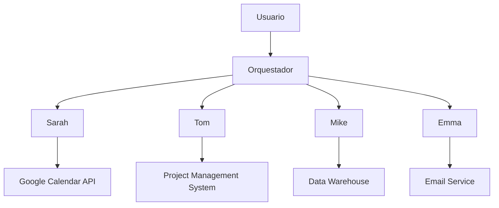

# Arquitectura del Sistema de Agentes Autónomos

## Visión General

### Agentes Actuales
1. **Sarah** (Calendar Agent)
2. **Tom** (Project Manager Agent)
3. **Mike** (Data Agent)
4. **Emma** (Email/Communication Agent)

### Agentes Planeados
1. **Alfred** (Office/Logistics Agent)
2. **Jarvis** (Documentation Agent)

## Diagrama de Arquitectura



## Flujo de Comunicación

### Protocolos
1. **HTTP/2** para comunicación sincrónica
2. **WebSockets** para actualizaciones en tiempo real
3. **Message Queue** para tareas asincrónicas

### Estándares de Mensajes
```json
{
  "sender": "agent_name",
  "receiver": "agent_name",
  "message_type": "request|response|notification",
  "payload": {},
  "timestamp": "ISO8601",
  "priority": "low|medium|high|critical"
}
```

## Plan de Implementación

### Fase 1: Core Functionality
1. Integración básica entre agentes existentes
2. Sistema de orquestación central
3. Memoria compartida básica

### Fase 2: Advanced Features
1. Implementación de Alfred y Jarvis
2. Sistema de aprendizaje colaborativo
3. Mejoras en la comunicación entre agentes

### Fase 3: Optimization
1. Sistema de caché distribuido
2. Balanceo de carga entre agentes
3. Monitoreo y alertas

## Pruebas y Deployment

### Ambiente de Pruebas
1. Sandbox con datos sintéticos
2. Simulador de interacciones
3. Sistema de métricas

### Plan de Deployment
1. Implementación gradual por módulos
2. Pruebas con usuarios reales
3. Sistema de feedback y mejora continua

## Documentación Relacionada
- [Roadmap de Sarah](/docs/calendar_agent_roadmap.md)
- [API Documentation](/docs/api.md)
- [Testing Guidelines](/docs/testing.md)
