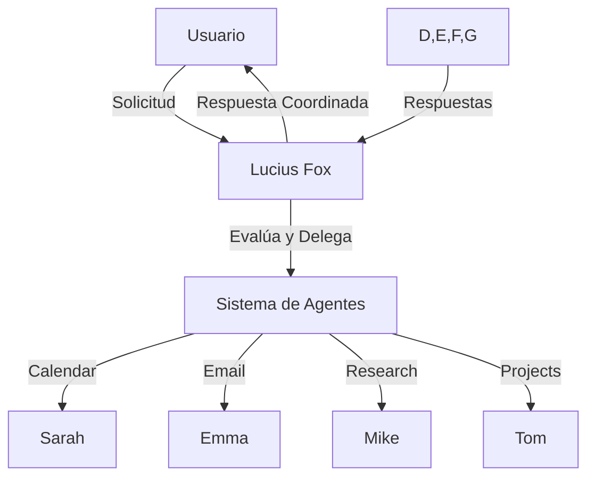

# Lucius Fox - Arquitectura y Plan de Implementación

## Arquitectura del Sistema

### 1. Sistema Multi-Agente
- [x] **Lucius Fox (Chief of Staff)**
  - [x] Rol: Coordinador principal
  - [x] Personalidad: Profesional, eficiente, proactivo
  - [x] Sistema base de delegación

- [x] **Sarah (Calendar Agent)**
  - [x] Gestión básica de agenda
  - [x] Personalidad: Eficiente y organizada
  - [ ] Integración con Google Calendar
  - [ ] Sistema avanzado de disponibilidad

- [x] **Karla (Email Agent)**
  - [x] Gestión de comunicaciones
  - [x] Integración con Gmail
  - [x] Personalidad: Comunicativa y detallista
  - [ ] Sistema de priorización de emails
  - [x] Funcionalidades implementadas:
    - [x] Revisar emails sin leer
    - [x] Marcar emails como leídos
    - [x] Búsqueda de emails
    - [ ] Organización automática

- [x] **Mike (Research Agent)**
  - [x] Investigación y análisis
    - [x] Análisis de texto con TextBlob
    - [x] Extracción de puntos clave
    - [x] Análisis de sentimiento
    - [x] Generación de resúmenes
  - [x] Sistema de búsqueda web
    - [x] Integración con SERP API
    - [x] Extracción de contenido web
    - [x] Análisis de resultados
  - [x] Personalidad: Analítico y metódico
  - [ ] Características pendientes:
    - [ ] Manejo robusto de errores
    - [ ] Soporte multilingüe
    - [ ] Sistema de citación
    - [ ] Integración con bases de conocimiento
    - [ ] Reportes estructurados

- [x] **Tom (Project Management Autonomo)**
  - [x] Seguimiento de proyectos
    - [x] Creación y gestión de proyectos
    - [x] Sistema de prioridades
    - [x] Persistencia en JSON
    - [ ] Categorización y etiquetas
    - [ ] Estados personalizados
  - [x] Gestión de tareas
    - [x] Creación y gestión de tareas
    - [x] Detección inteligente de nombres
    - [x] Sistema de prioridades
    - [ ] Asignación a proyectos
    - [ ] Dependencias entre tareas
  - [x] Personalidad: Organizado y orientado a objetivos
  - [ ] Sistema de tracking de progreso
    - [ ] Fechas límite y recordatorios
    - [ ] Métricas y KPIs
    - [ ] Reportes automáticos

### 2. Sistema de Orquestación
- [ ] **LangGraph Integration**
  - [ ] Definición de workflows entre autónomos
  - [ ] Monitoreo de estado y progreso
  - [ ] Control de carga y recursos
  - [ ] Manejo de errores y recuperación
  - [ ] Métricas de rendimiento

#### Workflows Iniciales
1. **Investigación y Documentación**
   ```mermaid
   graph LR
      Human -->|Solicitud| Lucius
      Lucius -->|Tarea investigación| Mike
      Mike -->|Resultados| Tom
      Tom -->|Organiza documentación| Lucius
      Lucius -->|Reporte| Human
   ```

2. **Gestión de Tareas**
   ```mermaid
   graph LR
      Human -->|Nueva tarea| Lucius
      Lucius -->|Evalúa prioridad| Tom
      Tom -->|Asigna recursos| Lucius
      Lucius -->|Confirma| Human
   ```

#### Principios de Diseño
- Mantener flujos simples y directos
- Evitar ciclos complejos entre autónomos
- Priorizar la experiencia del usuario
- Monitorear la carga cognitiva del humano
- Permitir override manual en cualquier punto

#### Métricas Clave
- Tiempo de respuesta
- Tasa de éxito en tareas
- Intervenciones manuales requeridas
- Carga cognitiva del usuario
- Uso de recursos por autónomo

### 3. Sistema de Conversación
- [x] **Threads en Slack**
  - [x] Implementación básica de threads
  - [x] Manejo de contexto por thread
  - [ ] Sistema avanzado de seguimiento
  - [ ] Notificaciones inteligentes

- [x] **Conversaciones Naturales**
  - [x] Respuestas contextuales básicas
  - [x] Coordinación entre agentes
  - [ ] Mejora en el lenguaje natural
  - [ ] Sistema de memoria conversacional

### 3. Integraciones
- [x] **Google Workspace**
  - [ ] Google Calendar API
  - [x] Gmail API
  - [ ] Google Drive API
  - [x] Sistema de autenticación OAuth2

- [x] **Slack**
  - [x] Comunicación básica
  - [x] Sistema de threads
  - [ ] Comandos avanzados
  - [ ] Interactive messages

### 4. Sistema de Contexto y Memoria
- [x] **Memoria por Conversación**
  - [x] Histórico básico
  - [x] Contexto de thread
  - [ ] Persistencia a largo plazo
  - [ ] Análisis de patrones

- [ ] **Preferencias de Usuario**
  - [ ] Sistema de preferencias
  - [ ] Aprendizaje automático
  - [ ] Personalización
  - [ ] Historial de decisiones

## Plan de Implementación

### Fase 1: Base del Sistema ✓
- [x] Implementar Lucius Fox base
- [x] Crear Calendar Agent (Sarah)
- [x] Establecer sistema de threads
- [x] Implementar memoria básica

### Fase 2: Expansión de Agentes (En Progreso)
- [x] Implementar Email Agent (Karla)
  - [x] Estructura base
  - [x] Integración Gmail
  - [x] Sistema de procesamiento de emails
  - [ ] Sistema avanzado de organización
  
- [x] Implementar Research Agent (Mike)
  - [x] Estructura base
  - [x] Sistema de búsqueda web
  - [x] Análisis de texto
  - [x] Procesamiento de documentos
  - [ ] Mejoras pendientes:
    - [ ] Integración con Lucius
    - [ ] Sistema de citación
    - [ ] Reportes avanzados

### Fase 3: Integraciones
- [ ] Google Calendar
- [ ] Gmail
- [ ] Google Drive
- [ ] Slack avanzado

### Fase 4: Mejoras y Refinamiento
- [ ] Sistema de memoria avanzado
- [ ] Mejoras en NLP
- [ ] UI/UX enhancements
- [ ] Optimizaciones de rendimiento

## Ejemplo de Interacción Objetivo

```
Usuario: @lucius_fox necesito preparar la reunión de directorio del próximo martes

Lucius: Por supuesto, me encargo de coordinar todo. Déjame consultar con el equipo.
└─ Lucius: Sarah (Calendar), ¿podrías revisar la disponibilidad y los detalles de la sala?
└─ Sarah: Claro Lucius. Veo que la sala de juntas está libre de 10 a 12. También hay un conflicto con otra reunión a las 9.
└─ Lucius: Gracias Sarah. Mike (Research), necesitamos los últimos reportes.
└─ Mike: En eso estoy. Acabo de encontrar los informes del último trimestre y las presentaciones anteriores.
└─ Lucius: @usuario He coordinado todo. La sala está reservada para las 10AM, y tendré los materiales listos mañana. ¿Necesitas algo específico para la agenda?
```

## Diagrama de Flujo


## Métricas de Progreso
- [x] Sistema base funcional
- [x] Primer agente especializado (Sarah)
- [x] Sistema de threads básico
- [x] Integración con LangGraph
- [ ] Integraciones con Google
- [ ] Sistema multi-agente completo
- [ ] Memoria avanzada
- [ ] Sistema de producción

## Estado Actual y Próximos Pasos

### Febrero 13, 2025 - Integración LangGraph

#### Completado
- Implementación de workflows usando LangGraph
- Integración de sistema de métricas
- Manejo de interrupciones para revisión humana
- Workflows de investigación y tareas

#### En Progreso
- Optimización de rendimiento
- Mejoras en manejo de errores
- Dashboard de monitoreo

#### Próximos Pasos
- Implementar retry con backoff
- Agregar más workflows
- Mejorar visualización

Ver más detalles en:
- [LangGraph Integration](langgraph_integration.md)
- [Future Improvements](future_improvements.md)
