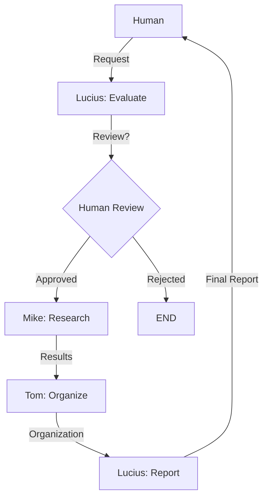
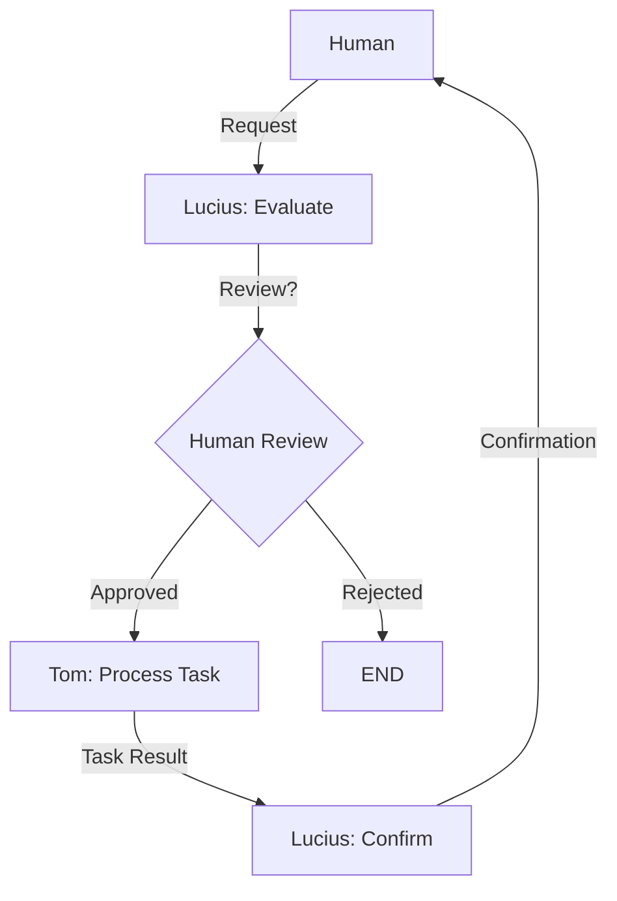

# Integración con LangGraph

## Arquitectura Actual

### 1. Workflows Implementados

#### Research Workflow

#### Task Workflow

### 2. Componentes Principales

#### Workflows (`langgraph_workflow.py`)
- Implementación usando la API funcional de LangGraph
- Soporte para tareas asíncronas
- Manejo de interrupciones para revisión humana
- Integración con sistema de métricas

#### Agentes
- **Lucius**: Chief of Staff, evaluación y coordinación
- **Mike**: Investigación y análisis
- **Tom**: Gestión de proyectos y tareas

#### Servicios
- **MetricsService**: Monitoreo y métricas
- **TaskService**: Gestión de tareas
- **ProjectService**: Gestión de proyectos

### 3. Características Implementadas

#### Control de Flujo
- Workflows definidos con `@entrypoint`
- Tareas asíncronas con `@task`
- Interrupciones para revisión humana
- Manejo de errores y recuperación

#### Monitoreo
- Métricas de carga cognitiva
- Estado del sistema
- Rendimiento de autónomos
- Registro de errores

#### Persistencia
- Checkpointing con MemorySaver
- Estado persistente entre reinicios
- Historial de interacciones

## Próximos Pasos

### 1. Mejoras Técnicas
- Implementar retry con backoff exponencial
- Mejorar manejo de errores
- Optimizar rendimiento
- Agregar pruebas unitarias

### 2. Nuevos Workflows
- Workflow de documentación
- Workflow de análisis
- Workflow de comunicación
- Workflow de aprendizaje

### 3. Visualización
- Dashboard en tiempo real
- Gráficos de métricas
- Estado de workflows
- Alertas y notificaciones

### 4. Integración
- Conectar con otros sistemas
- APIs externas
- Base de datos
- Servicios de terceros
