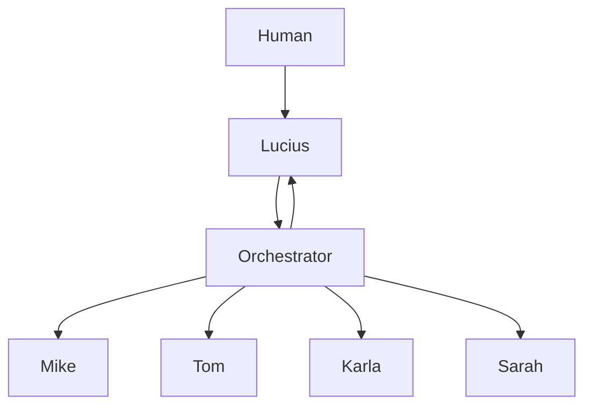

# Sistema de Orquestación con LangGraph

## Objetivos
1. Gestionar el flujo de información entre autónomos
2. Monitorear el estado y rendimiento del sistema
3. Optimizar la interacción humano-autónomo
4. Prevenir sobrecarga cognitiva del usuario
5. Mantener el sistema escalable y mantenible

## Arquitectura Base

### Componentes Principales


### Responsabilidades
1. **Human**: Punto de entrada principal, define objetivos
2. **Lucius**: Coordinador principal, toma decisiones de alto nivel
3. **Orchestrator**: Gestiona flujos y recursos
4. **Autónomos**: Ejecutan tareas específicas

## Implementación con LangGraph

### Estructura Base
```python
from langgraph.graph import Graph, MessageGraph
from langgraph.presets import AutonomousAgent

class Orchestrator:
    def __init__(self):
        self.graph = MessageGraph()
        self.agents = {}
        self.metrics = {}
        
    def add_agent(self, name: str, agent: AutonomousAgent):
        self.agents[name] = agent
        self.metrics[name] = {
            'tasks_completed': 0,
            'avg_response_time': 0,
            'error_rate': 0
        }
        
    def create_workflow(self, workflow_def: dict):
        # Define nodes and edges based on workflow
        pass
        
    def monitor_metrics(self):
        # Track and analyze system metrics
        pass
```

### Workflows Predefinidos

#### 1. Investigación
```python
research_workflow = {
    'trigger': 'research_request',
    'steps': [
        ('lucius', 'evaluate_request'),
        ('mike', 'conduct_research'),
        ('tom', 'organize_results'),
        ('lucius', 'prepare_report')
    ],
    'fallbacks': {
        'mike_error': 'lucius.handle_research_error',
        'timeout': 'lucius.request_clarification'
    }
}
```

#### 2. Gestión de Tareas
```python
task_workflow = {
    'trigger': 'new_task',
    'steps': [
        ('lucius', 'evaluate_task'),
        ('tom', 'process_task'),
        ('lucius', 'confirm_assignment')
    ],
    'fallbacks': {
        'overload': 'lucius.redistribute_tasks',
        'priority_conflict': 'lucius.resolve_priority'
    }
}
```

## Control de Carga

### Métricas de Monitoreo
1. **Por Autónomo**
   - Tareas en cola
   - Tiempo promedio de respuesta
   - Tasa de éxito
   - Uso de recursos

2. **Sistema Global**
   - Throughput total
   - Latencia end-to-end
   - Tasa de intervención humana
   - Carga cognitiva estimada

### Límites y Alertas
```python
SYSTEM_LIMITS = {
    'max_concurrent_tasks': 5,
    'max_response_time': 60,  # segundos
    'max_cognitive_load': 0.7,  # 70% de capacidad
    'min_success_rate': 0.95
}

ALERTS = {
    'high_load': lambda: notify_admin("Sistema cerca de capacidad máxima"),
    'high_latency': lambda: optimize_workflows(),
    'low_success': lambda: trigger_diagnostic()
}
```

## Gestión de Errores

### Estrategias de Recuperación
1. **Retry con backoff**
   ```python
   async def retry_with_backoff(task, max_attempts=3):
       for attempt in range(max_attempts):
           try:
               return await task()
           except Exception as e:
               if attempt == max_attempts - 1:
                   raise
               await asyncio.sleep(2 ** attempt)
   ```

2. **Fallback a modo manual**
   ```python
   async def fallback_to_manual(error, context):
       await notify_human(
           f"Error en tarea: {error}\n"
           f"Contexto: {context}\n"
           "¿Cómo proceder?"
       )
   ```

### Logging y Diagnóstico
```python
LOGGING_CONFIG = {
    'version': 1,
    'handlers': {
        'console': {'level': 'INFO'},
        'file': {'level': 'DEBUG'},
        'metrics': {'level': 'DEBUG'}
    },
    'root': {
        'handlers': ['console', 'file', 'metrics']
    }
}
```

## Próximos Pasos

### Fase 1: Fundamentos
1. Implementar estructura base con LangGraph
2. Configurar workflows básicos
3. Establecer sistema de métricas

### Fase 2: Optimización
1. Implementar control de carga
2. Refinar estrategias de recuperación
3. Mejorar logging y diagnóstico

### Fase 3: Escalabilidad
1. Agregar workflows complejos
2. Implementar balanceo de carga
3. Optimizar uso de recursos
