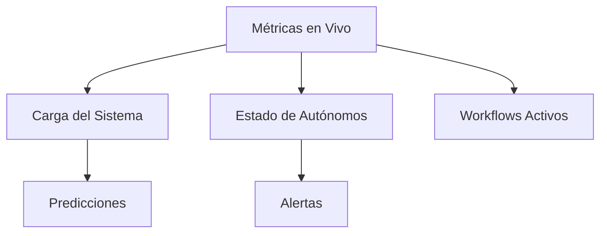
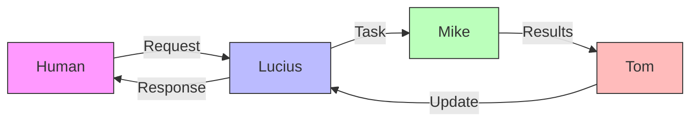

# Mejoras del Sistema de Orquestación

## Integración con LangGraph

### Visualización de Workflows
```python
from langgraph.graph import StateGraph, END
from typing import Dict, TypedDict

class AgentState(TypedDict):
    messages: List[str]
    current_agent: str
    workflow_status: str

# Definición del grafo
workflow = StateGraph(AgentState)

# Nodos para cada autónomo
workflow.add_node("lucius", lucius_agent)
workflow.add_node("mike", mike_agent)
workflow.add_node("tom", tom_agent)

# Edges con condiciones
workflow.add_edge("lucius", "mike", should_research)
workflow.add_edge("mike", "tom", should_organize)
workflow.add_edge("tom", "lucius", should_report)
workflow.add_edge("lucius", END, is_complete)
```

### Monitoreo en Tiempo Real
```python
# Event stream para monitoreo
events = workflow.event_stream()

# Callback para UI
@events.on_message
async def update_ui(event):
    ui.update_graph(event.node, event.status)
    ui.update_metrics(event.metrics)
```

## Mejoras Prioritarias

### 1. Comunicación Entre Autónomos
- [ ] Implementar protocolo estándar de mensajes
```python
Message = {
    'type': 'task|research|report',
    'content': str,
    'metadata': {
        'priority': str,
        'deadline': datetime,
        'context': Dict
    },
    'history': List[Dict]
}
```

### 2. Manejo de Errores y Recuperación
- [ ] Implementar retry con backoff exponencial
```python
async def with_retry(func, max_attempts=3):
    for attempt in range(max_attempts):
        try:
            return await func()
        except Exception as e:
            if attempt == max_attempts - 1:
                raise
            delay = (2 ** attempt) + random.uniform(0, 0.1)
            await asyncio.sleep(delay)
```

### 3. Métricas Avanzadas
- [ ] Implementar métricas predictivas
```python
class PredictiveMetrics:
    def predict_load(self, window_size=3600):
        # Usar ventana deslizante para predecir carga
        pass
        
    def detect_anomalies(self):
        # Detectar patrones anómalos
        pass
```

### 4. Optimización de Workflows
- [ ] Implementar rutas dinámicas basadas en carga
```python
class DynamicRouter:
    def get_next_step(self, context, metrics):
        if metrics.system_load > 0.8:
            return self.get_lightweight_path()
        return self.get_optimal_path()
```

## Visualización y Monitoreo

### 1. Dashboard en Tiempo Real


### 2. Análisis de Workflows


## Integración con LangGraph

### 1. Configuración de Nodos
```python
from langgraph.presets import AgentNode

class AutonomoNode(AgentNode):
    async def process(self, state: Dict) -> Dict:
        # Procesar mensaje
        result = await self.agent.process(
            state["message"],
            state["context"]
        )
        
        # Actualizar estado
        return {
            **state,
            "result": result,
            "metrics": self.get_metrics()
        }
```

### 2. Monitoreo de Estado
```python
class WorkflowMonitor:
    def __init__(self, graph: StateGraph):
        self.graph = graph
        self.metrics = MetricsService()
        
    async def on_node_enter(self, node: str, state: Dict):
        await self.metrics.record_transition(node, state)
        
    async def on_node_exit(self, node: str, state: Dict):
        await self.metrics.record_completion(node, state)
```

### 3. Visualización
```python
from langgraph.visualization import visualize

def create_visualization(graph: StateGraph):
    return visualize(
        graph,
        show_messages=True,
        show_metrics=True,
        update_interval=1.0
    )
```

## Próximos Pasos

1. **Fase 1: LangGraph Base**
   - Implementar nodos básicos
   - Configurar flujos simples
   - Establecer monitoreo básico

2. **Fase 2: Métricas y Monitoreo**
   - Integrar métricas existentes
   - Implementar dashboard
   - Configurar alertas

3. **Fase 3: Optimización**
   - Implementar rutas dinámicas
   - Mejorar manejo de errores
   - Optimizar rendimiento

4. **Fase 4: Escalabilidad**
   - Agregar más workflows
   - Implementar balanceo de carga
   - Mejorar resiliencia
